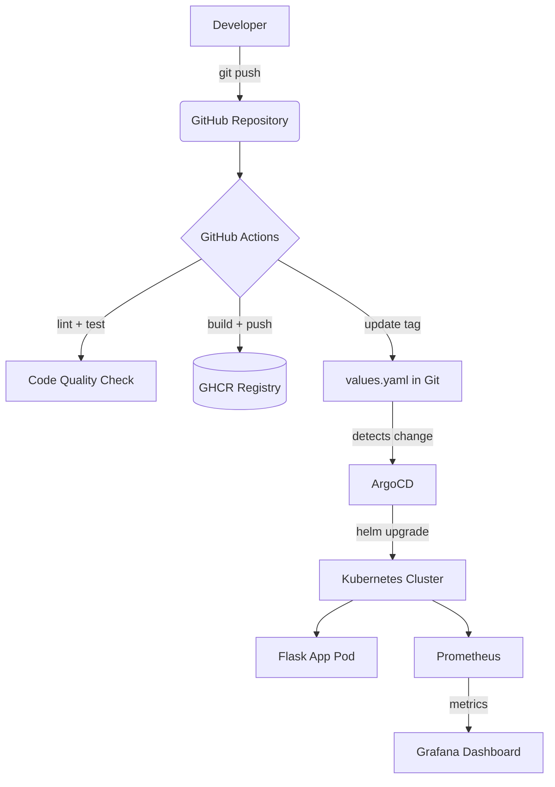

# GitOps Platform with Kubernetes & ArgoCD

## About the Project

Pet project to demonstrate **DevOps Engineer** skills. Full GitOps pipeline implemented:
- Automatic Docker image build and push to GHCR
- GitOps auto-deployment via ArgoCD
- Kubernetes orchestration with Helm charts
- Monitoring with Prometheus and Grafana

## Architecture



## Tech Stack

| Category | Tools |
|----------|-------|
| **Application** | Python 3.11, Flask |
| **Containerization** | Docker, multi-stage build |
| **CI** | GitHub Actions |
| **CD** | ArgoCD (GitOps) |
| **Orchestration** | Kubernetes, kind |
| **Package Manager** | Helm |
| **Monitoring** | Prometheus, Grafana |
| **Image Registry** | GitHub Container Registry (GHCR) |

## How It Works

1. Push code to `main`
2. GitHub Actions runs lint (`flake8`) and Helm chart validation
3. Docker image is built and pushed to GHCR with git SHA tag
4. CI auto-commits updated `image.tag` in `values.yaml`
5. ArgoCD detects the change and syncs the cluster automatically
6. Prometheus scrapes `/metrics` from the app every 15s
7. Grafana displays live dashboards

## Local Setup

### Prerequisites

- Docker Desktop
- kubectl
- kind
- helm

### Run Locally

```bash
# Create cluster
kind create cluster --name gitops-demo

# Install ArgoCD
kubectl create namespace argocd
kubectl apply -n argocd -f https://raw.githubusercontent.com/argoproj/argo-cd/stable/manifests/install.yaml --server-side --force-conflicts

# Deploy app
kubectl apply -f argocd/application.yaml

# Install monitoring
helm repo add prometheus-community https://prometheus-community.github.io/helm-charts
helm install monitoring prometheus-community/kube-prometheus-stack -n monitoring --create-namespace --set grafana.adminPassword=admin123
```

### Access UIs

```bash
# ArgoCD
kubectl port-forward svc/argocd-server -n argocd 8080:443
# https://localhost:8080  |  admin / see secret below
kubectl -n argocd get secret argocd-initial-admin-secret -o jsonpath="{.data.password}" | base64 -d

# Grafana
kubectl port-forward svc/monitoring-grafana -n monitoring 3000:80
# http://localhost:3000  |  admin / admin123

# Flask App
kubectl port-forward svc/flask-app 8888:80
# http://localhost:8888
```
