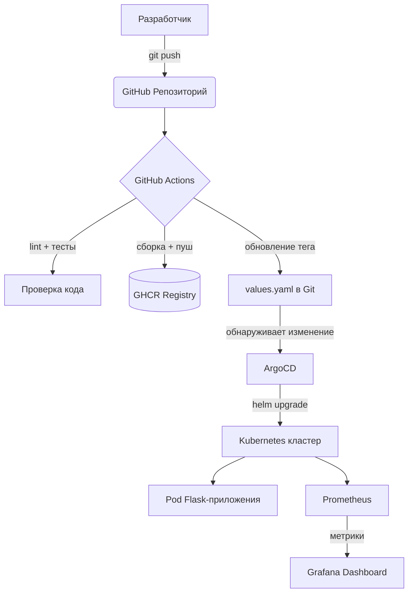

# GitOps платформа с Kubernetes и ArgoCD

## О проекте

Пет-проект для демонстрации навыков **DevOps-инженера**. Реализован полный GitOps-пайплайн:
- Автоматическая сборка Docker-образа и публикация в GHCR
- Автодеплой через ArgoCD по принципу GitOps
- Оркестрация контейнеров с помощью Kubernetes и Helm
- Мониторинг через Prometheus и Grafana

## Архитектура



## Стек технологий

| Категория | Инструменты |
|-----------|-------------|
| **Приложение** | Python 3.11, Flask |
| **Контейнеризация** | Docker, multi-stage сборка |
| **CI** | GitHub Actions |
| **CD** | ArgoCD (GitOps) |
| **Оркестрация** | Kubernetes, kind |
| **Пакетный менеджер** | Helm |
| **Мониторинг** | Prometheus, Grafana |
| **Реестр образов** | GitHub Container Registry (GHCR) |

## Как это работает

1. Пуш кода в ветку `main`
2. GitHub Actions запускает линтер (`flake8`) и валидацию Helm-чарта
3. Docker-образ собирается и пушится в GHCR с тегом из git SHA
4. CI автоматически коммитит обновлённый `image.tag` в `values.yaml`
5. ArgoCD обнаруживает изменение и синхронизирует кластер
6. Prometheus собирает метрики с `/metrics` каждые 15 секунд
7. Grafana отображает дашборды в реальном времени

## Локальный запуск

### Требования

- Docker Desktop
- kubectl
- kind
- helm

### Запуск

```bash
# Создать кластер
kind create cluster --name gitops-demo

# Установить ArgoCD
kubectl create namespace argocd
kubectl apply -n argocd -f https://raw.githubusercontent.com/argoproj/argo-cd/stable/manifests/install.yaml --server-side --force-conflicts

# Задеплоить приложение
kubectl apply -f argocd/application.yaml

# Установить мониторинг
helm repo add prometheus-community https://prometheus-community.github.io/helm-charts
helm install monitoring prometheus-community/kube-prometheus-stack -n monitoring --create-namespace --set grafana.adminPassword=admin123
```

### Доступ к интерфейсам

```bash
# ArgoCD
kubectl port-forward svc/argocd-server -n argocd 8080:443
# https://localhost:8080  |  admin / смотри секрет ниже
kubectl -n argocd get secret argocd-initial-admin-secret -o jsonpath="{.data.password}" | base64 -d

# Grafana
kubectl port-forward svc/monitoring-grafana -n monitoring 3000:80
# http://localhost:3000  |  admin / admin123

# Flask-приложение
kubectl port-forward svc/flask-app 8888:80
# http://localhost:8888
```
